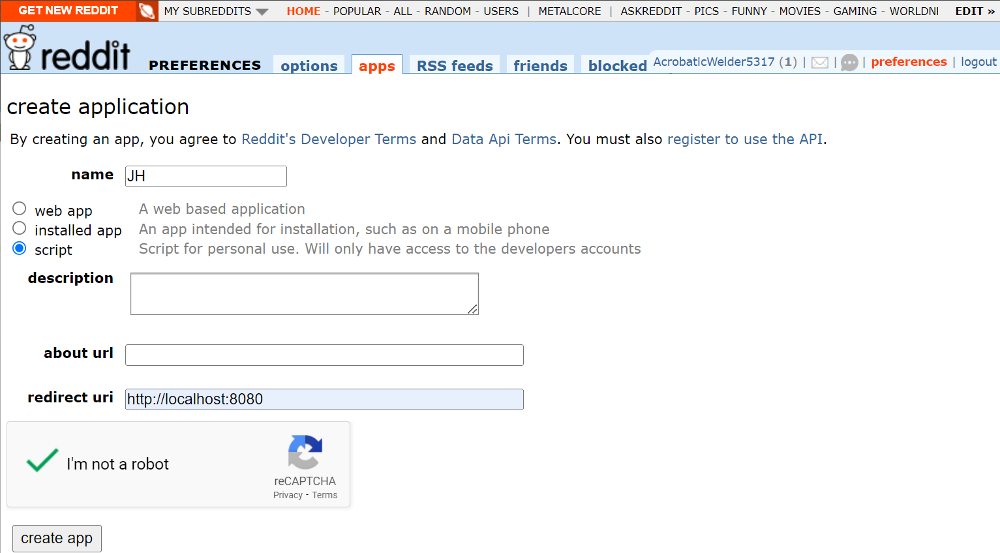
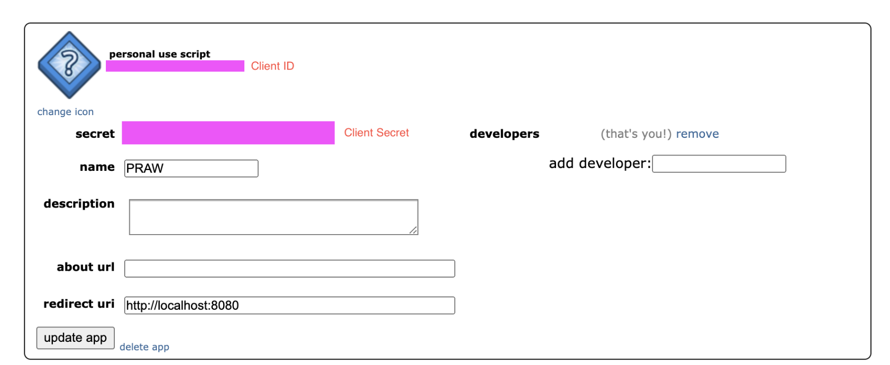

https://praw.readthedocs.io/en/stable/
https://www.reddit.com/prefs/apps
https://pypi.org/project/praw/
https://www.reddit.com/r/reddit.com/wiki/api/

1. Install Pycharm, once you have installed Pycharm create a new
project using Jupyter notebook.  After that is completed

2. Register API here https://www.reddit.com/r/reddit.com/wiki/api/.

3. Use https://www.reddit.com/prefs/apps, set to script create name
then create app.

In pycharm open the terminal and perform the below installs.

1. install python
2. install pip
3. install praw
4.  install pandas

open the jh-scrape replace the client ID, client secret 
with the new generated keys and make sure to use the name you created for the user-agent

after the keys and agent are added just press the play button at the top for each
section to get the results.